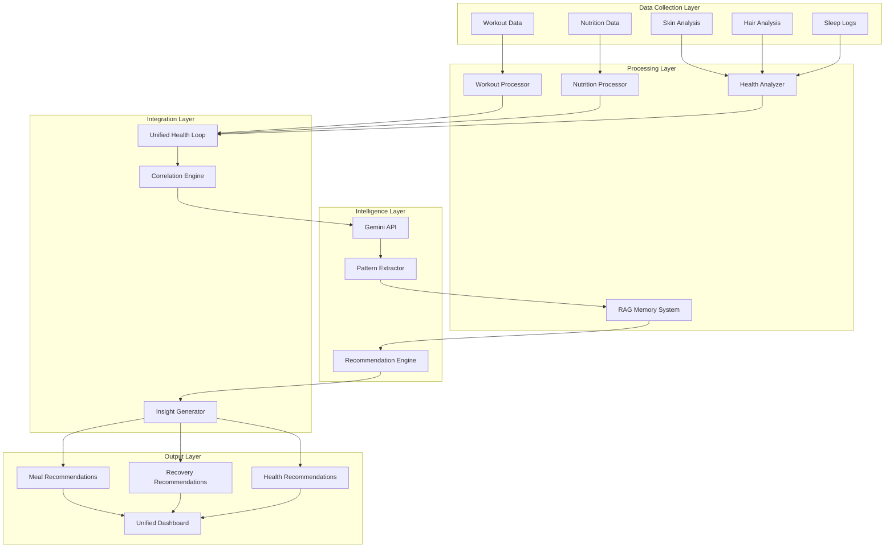

# Nutrition & Meal Planning System Architecture

## System Overview

The nutrition system is a sophisticated, LLM-powered meal planning and recommendation engine that integrates with workout data, health metrics, and user preferences to provide personalized nutrition guidance.

## 1. LLM-Powered Meal Planning Architecture

### 1.1 Pantry-Based Meal Suggestions

```typescript
// Core Pantry Management System
interface PantryItem {
  _id: ObjectId;
  userId: string;
  itemName: string;
  category: 'protein' | 'carb' | 'vegetable' | 'dairy' | 'spice' | 'other';
  quantity: number;
  unit: string;
  expiryDate?: Date;
  nutritionalInfo?: {
    proteinPer100g: number;
    caloriesPer100g: number;
    carbsPer100g: number;
    fatPer100g: number;
  };
  lastUpdated: Date;
}

// Meal Generation Request
interface MealGenerationRequest {
  userId: string;
  availableIngredients: PantryItem[];
  targetProtein: number; // Calculated from workout data
  mealType: 'breakfast' | 'lunch' | 'dinner' | 'snack';
  cuisinePreference?: string[];
  dietaryRestrictions: string[];
  cookingTime?: number; // minutes
  complexity?: 'simple' | 'moderate' | 'complex';
}
```

**Gemini API Integration Pattern:**

```javascript
async function generateMealFromPantry(request: MealGenerationRequest) {
  const workoutContext = await getRecentWorkoutData(request.userId);
  const userPreferences = await getUserPreferencesFromRAG(request.userId);

  const prompt = `
    Generate a high-protein meal recipe optimized for post-workout recovery.

    Context:
    - Recent workout: ${workoutContext.exerciseType} with ${workoutContext.totalVolume}kg volume
    - Target protein: ${request.targetProtein}g
    - Available ingredients: ${formatIngredients(request.availableIngredients)}
    - User preferences: ${userPreferences.summary}
    - Dietary restrictions: ${request.dietaryRestrictions.join(', ')}

    Requirements:
    1. Maximize protein content using available ingredients
    2. Include preparation steps optimized for ${request.cookingTime} minutes
    3. Suggest protein additions if target cannot be met with current ingredients
    4. Provide macronutrient breakdown
    5. Include recovery-specific benefits based on workout type

    Format response as JSON with structure:
    {
      "recipeName": "",
      "totalProtein": 0,
      "ingredients": [],
      "instructions": [],
      "macros": {},
      "recoveryBenefits": [],
      "missingForOptimal": []
    }
  `;

  const response = await geminiAPI.generateContent({
    model: 'gemini-1.5-pro',
    contents: [{ parts: [{ text: prompt }] }],
    generationConfig: {
      temperature: 0.7,
      maxOutputTokens: 2048,
      responseMimeType: "application/json"
    }
  });

  return JSON.parse(response.candidates[0].content.parts[0].text);
}
```

### 1.2 Workout-Aware Protein Targeting

```typescript
// Protein Calculation Engine
class ProteinTargetCalculator {
  calculateDailyTarget(user: User, workoutData: WorkoutSession[]): ProteinTarget {
    const baseProtein = user.weight_kg * 1.6; // Base multiplier

    // Analyze recent workout volume and intensity
    const recentWorkouts = workoutData.filter(w =>
      w.date > new Date(Date.now() - 7 * 24 * 60 * 60 * 1000)
    );

    const avgVolume = this.calculateAverageVolume(recentWorkouts);
    const muscleGroupsWorked = this.identifyMuscleGroups(recentWorkouts);
    const recoveryNeed = this.calculateRecoveryNeed(avgVolume, muscleGroupsWorked);

    // Adjust protein based on workout intensity
    let adjustedProtein = baseProtein;
    if (recoveryNeed === 'high') {
      adjustedProtein *= 1.3; // 30% increase for heavy training
    } else if (recoveryNeed === 'moderate') {
      adjustedProtein *= 1.15;
    }

    // Distribute across meals
    return {
      daily: Math.round(adjustedProtein),
      perMeal: {
        breakfast: Math.round(adjustedProtein * 0.25),
        lunch: Math.round(adjustedProtein * 0.35),
        dinner: Math.round(adjustedProtein * 0.30),
        snack: Math.round(adjustedProtein * 0.10)
      },
      postWorkout: Math.round(adjustedProtein * 0.3), // 30% post-workout
      rationale: this.generateRationale(user, recentWorkouts, adjustedProtein)
    };
  }

  private calculateAverageVolume(workouts: WorkoutSession[]): number {
    return workouts.reduce((sum, w) => {
      return sum + w.exercises.reduce((eSum, e) => {
        return eSum + (e.sets * e.reps * e.weight_kg);
      }, 0);
    }, 0) / workouts.length;
  }
}
```

### 1.3 Authentic Dish Scraping + Protein Optimization

```javascript
// Web Scraping + Recipe Enhancement System
class AuthenticRecipeOptimizer {
  async scrapeAndOptimize(cuisine: string, dishName: string): Promise<OptimizedRecipe> {
    // Step 1: Scrape authentic recipes
    const authenticRecipes = await this.scrapeAuthenticRecipes(cuisine, dishName);

    // Step 2: Analyze with Gemini for protein optimization
    const optimizationPrompt = `
      Analyze these authentic ${cuisine} recipes for "${dishName}":
      ${JSON.stringify(authenticRecipes)}

      Task: Enhance protein content while maintaining authenticity

      Provide:
      1. Traditional protein sources used in ${cuisine} cuisine
      2. Culturally appropriate protein additions that won't compromise authenticity
      3. Cooking technique modifications to increase protein absorption
      4. Specific ingredient ratios to optimize protein while keeping traditional taste
      5. Alternative high-protein versions used in ${cuisine} fitness communities

      Constraints:
      - Must maintain flavor profile
      - Use ingredients available in typical grocery stores
      - Keep preparation authentic to ${cuisine} cooking methods
    `;

    const optimization = await geminiAPI.generateContent({
      model: 'gemini-1.5-pro',
      contents: [{ parts: [{ text: optimizationPrompt }] }]
    });

    return this.formatOptimizedRecipe(authenticRecipes[0], optimization);
  }

  private async scrapeAuthenticRecipes(cuisine: string, dishName: string) {
    // Implementation for web scraping
    const searchQuery = `authentic ${cuisine} ${dishName} recipe traditional`;
    // Use Puppeteer or Playwright for dynamic content
    // Parse ingredients and instructions
    return scraped_recipes;
  }
}
```

### 1.4 Restaurant Menu OCR and Ranking System

```typescript
// OCR Menu Processing Pipeline
class RestaurantMenuAnalyzer {
  async processMenuImage(imageBuffer: Buffer, userProfile: UserProfile): Promise<MenuAnalysis> {
    // Step 1: OCR Processing
    const ocrResult = await this.performOCR(imageBuffer);

    // Step 2: Structure extraction with Gemini
    const structuredMenu = await this.extractMenuStructure(ocrResult.text);

    // Step 3: Nutritional analysis and ranking
    const rankedItems = await this.rankMenuItems(structuredMenu, userProfile);

    return {
      restaurantName: structuredMenu.restaurantName,
      items: rankedItems,
      recommendations: this.generateRecommendations(rankedItems, userProfile),
      warnings: this.identifyAllergens(rankedItems, userProfile.allergies)
    };
  }

  private async rankMenuItems(menu: StructuredMenu, profile: UserProfile): Promise<RankedMenuItem[]> {
    const prompt = `
      Analyze and rank these menu items for optimal nutrition:

      Menu Items: ${JSON.stringify(menu.items)}

      User Profile:
      - Daily protein target: ${profile.proteinTarget}g
      - Already consumed today: ${profile.consumedProtein}g
      - Dietary restrictions: ${profile.restrictions.join(', ')}
      - Fitness goal: ${profile.fitnessGoal}

      For each item, estimate:
      1. Protein content (grams)
      2. Total calories
      3. Protein-to-calorie ratio
      4. Hidden sugars/oils likelihood
      5. Recovery benefit score (1-10)

      Rank by:
      - Primary: Protein efficiency (protein per calorie)
      - Secondary: Overall nutritional value
      - Tertiary: Alignment with user's remaining daily targets

      Include modifications to optimize each dish (e.g., "ask for grilled instead of fried")
    `;

    const analysis = await geminiAPI.generateContent({
      model: 'gemini-1.5-pro',
      contents: [{ parts: [{ text: prompt }] }],
      generationConfig: { responseMimeType: "application/json" }
    });

    return JSON.parse(analysis.candidates[0].content.parts[0].text);
  }
}
```

## 2. RAG System Architecture

### 2.1 Memory Layer Design

```typescript
// RAG Memory Architecture
interface UserMemorySystem {
  shortTermMemory: ChatMemory[];      // Recent conversations (last 7 days)
  longTermMemory: ConsolidatedPattern[]; // Extracted patterns
  preferences: UserPreferenceVector;   // Embedded preferences
  contextWindow: ContextualMemory[];   // Active context for current session
}

// Consolidated Pattern Storage
interface ConsolidatedPattern {
  _id: ObjectId;
  userId: string;
  patternType: 'food_preference' | 'meal_timing' | 'ingredient_aversion' |
               'portion_size' | 'cuisine_preference' | 'cooking_method';
  pattern: {
    description: string;
    confidence: number; // 0-1 confidence score
    evidence: string[]; // Chat references that support this pattern
    lastUpdated: Date;
    frequency: number; // How often this pattern appears
  };
  embedding: number[]; // Vector embedding for similarity search
}

// Chat Storage Schema
interface ChatMemory {
  _id: ObjectId;
  userId: string;
  sessionId: string;
  timestamp: Date;
  messages: {
    role: 'user' | 'assistant';
    content: string;
    intent?: string; // Classified intent
    entities?: Entity[]; // Extracted entities (foods, ingredients, preferences)
  }[];
  extractedInfo: {
    preferences: string[];
    restrictions: string[];
    feedback: { positive: string[], negative: string[] };
  };
  consolidated: boolean; // Has this been processed for patterns?
}
```

### 2.2 Background Consolidation System

```javascript
// Pattern Extraction and Consolidation Service
class MemoryConsolidationService {
  async consolidateUserMemory(userId: string) {
    // Run every 24 hours or after significant interactions
    const recentChats = await this.getUnconsolidatedChats(userId);

    if (recentChats.length < 5) return; // Need minimum data

    // Extract patterns using Gemini
    const patterns = await this.extractPatterns(recentChats);

    // Update or create consolidated patterns
    for (const pattern of patterns) {
      await this.updatePattern(userId, pattern);
    }

    // Generate embeddings for semantic search
    await this.updateEmbeddings(userId);

    // Mark chats as consolidated
    await this.markChatsConsolidated(recentChats.map(c => c._id));
  }

  private async extractPatterns(chats: ChatMemory[]): Promise<Pattern[]> {
    const conversationHistory = this.formatChatsForAnalysis(chats);

    const prompt = `
      Analyze these nutrition-related conversations and extract recurring patterns:

      ${conversationHistory}

      Extract:
      1. Food preferences (likes/dislikes)
      2. Meal timing patterns
      3. Portion size preferences
      4. Cooking method preferences
      5. Ingredient aversions or allergies
      6. Cultural/cuisine preferences
      7. Nutritional goals or concerns
      8. Feedback on previous recommendations

      For each pattern found:
      - Provide confidence score (0-1)
      - List supporting evidence from conversations
      - Note any contradictions
      - Suggest how to use this in future recommendations

      Return as JSON array of patterns.
    `;

    const analysis = await geminiAPI.generateContent({
      model: 'gemini-1.5-pro',
      contents: [{ parts: [{ text: prompt }] }],
      generationConfig: { responseMimeType: "application/json" }
    });

    return JSON.parse(analysis.candidates[0].content.parts[0].text);
  }

  async updatePattern(userId: string, newPattern: ExtractedPattern) {
    const existing = await db.consolidatedPatterns.findOne({
      userId,
      patternType: newPattern.type
    });

    if (existing) {
      // Merge new evidence with existing
      existing.pattern.evidence.push(...newPattern.evidence);
      existing.pattern.frequency += 1;
      existing.pattern.confidence = this.recalculateConfidence(existing, newPattern);
      existing.pattern.lastUpdated = new Date();

      await db.consolidatedPatterns.updateOne(
        { _id: existing._id },
        { $set: existing }
      );
    } else {
      // Create new pattern
      await db.consolidatedPatterns.insertOne({
        userId,
        patternType: newPattern.type,
        pattern: {
          description: newPattern.description,
          confidence: newPattern.confidence,
          evidence: newPattern.evidence,
          lastUpdated: new Date(),
          frequency: 1
        },
        embedding: await this.generateEmbedding(newPattern.description)
      });
    }
  }
}
```

### 2.3 MongoDB Schema for RAG System

```javascript
// MongoDB Collections Schema
const ragSchemas = {
  // User preferences learned over time
  userPreferences: {
    _id: ObjectId,
    userId: String,
    preferences: {
      cuisines: [{ name: String, score: Number }],
      ingredients: {
        loved: [String],
        disliked: [String],
        allergic: [String]
      },
      mealTiming: {
        breakfast: { preferred: String, window: String },
        lunch: { preferred: String, window: String },
        dinner: { preferred: String, window: String }
      },
      portionSizes: String, // 'small', 'medium', 'large'
      spiceLevel: Number, // 1-10
      cookingMethods: [String] // preferred methods
    },
    lastUpdated: Date,
    version: Number
  },

  // Chat history with extracted insights
  chatSessions: {
    _id: ObjectId,
    userId: String,
    sessionId: String,
    startTime: Date,
    endTime: Date,
    messages: [{
      timestamp: Date,
      role: String,
      content: String,
      extractedEntities: [{
        type: String,
        value: String,
        confidence: Number
      }],
      sentiment: String,
      feedback: String // positive, negative, neutral
    }],
    summary: String, // LLM-generated session summary
    extractedPreferences: [String],
    mealRecommendations: [{
      mealId: String,
      accepted: Boolean,
      feedback: String
    }]
  },

  // Consolidated memory patterns
  memoryPatterns: {
    _id: ObjectId,
    userId: String,
    patternType: String,
    pattern: Object,
    embedding: [Number], // Vector for similarity search
    confidence: Number,
    lastReinforced: Date,
    occurrences: Number
  },

  // Meal recommendation history
  recommendationHistory: {
    _id: ObjectId,
    userId: String,
    recommendationId: String,
    timestamp: Date,
    context: {
      recentWorkout: Object,
      nutritionalNeeds: Object,
      availableIngredients: [String]
    },
    recommendation: Object,
    userFeedback: {
      accepted: Boolean,
      rating: Number,
      comments: String,
      modifications: [String]
    },
    outcomes: {
      mealPrepared: Boolean,
      satisfactionScore: Number,
      wouldRepeat: Boolean
    }
  }
};
```

### 2.4 Effective Meal Recommendation Structure

```javascript
class IntelligentMealRecommender {
  async generateRecommendation(userId: string, context: MealContext): Promise<MealRecommendation> {
    // 1. Retrieve user's memory patterns
    const memoryPatterns = await this.getMemoryPatterns(userId);

    // 2. Get recent interaction context
    const recentContext = await this.getRecentContext(userId);

    // 3. Analyze current nutritional needs
    const nutritionalNeeds = await this.analyzeNutritionalNeeds(userId, context);

    // 4. Build comprehensive prompt with memory
    const recommendationPrompt = this.buildSmartPrompt(
      memoryPatterns,
      recentContext,
      nutritionalNeeds,
      context
    );

    // 5. Generate recommendation with Gemini
    const recommendation = await this.callGeminiWithMemory(recommendationPrompt);

    // 6. Post-process and personalize
    return this.personalizeRecommendation(recommendation, memoryPatterns);
  }

  private buildSmartPrompt(patterns, context, needs, currentContext) {
    return `
      Generate a personalized meal recommendation based on comprehensive user history:

      LEARNED PREFERENCES (High Confidence):
      ${patterns.filter(p => p.confidence > 0.7).map(p =>
        `- ${p.pattern.description} (${p.occurrences} times observed)`
      ).join('\n')}

      RECENT CONTEXT:
      - Last 3 meals: ${context.recentMeals.map(m => m.name).join(', ')}
      - Recent feedback: ${context.recentFeedback.summary}
      - Avoided recently: ${context.recentlyAvoided.join(', ')}

      CURRENT NUTRITIONAL NEEDS:
      - Protein target: ${needs.protein}g (${needs.proteinRationale})
      - Energy needs: ${needs.calories}kcal
      - Recovery focus: ${needs.recoveryFocus}
      - Micronutrient gaps: ${needs.micronutrientGaps.join(', ')}

      CURRENT CONTEXT:
      - Meal type: ${currentContext.mealType}
      - Time available: ${currentContext.timeAvailable}
      - Ingredients: ${currentContext.availableIngredients.join(', ')}

      REQUIREMENTS:
      1. Honor high-confidence preferences
      2. Avoid recent repetitions
      3. Meet protein target precisely
      4. Include variety from last 3 days
      5. Suggest prep optimizations based on time available

      Format as detailed recipe with:
      - Ingredients with exact quantities
      - Step-by-step instructions
      - Macronutrient breakdown
      - Prep/cook time
      - Why this matches user preferences (explain reasoning)
    `;
  }
}
```

## 3. Cross-System Integration

### 3.1 Nutrition → Workout Recovery Flow

```typescript
// Recovery Recommendation Engine
class RecoveryNutritionEngine {
  async generatePostWorkoutNutrition(workoutSession: WorkoutSession, userId: string) {
    const musclesWorked = this.identifyMusclesWorked(workoutSession);
    const workoutIntensity = this.calculateIntensity(workoutSession);
    const recoveryWindow = this.determineRecoveryWindow(workoutIntensity);

    const nutritionPlan = {
      immediate: { // Within 30 minutes
        protein: this.calculateImmediateProtein(workoutIntensity),
        carbs: this.calculateGlycogenReplenishment(workoutSession.duration),
        hydration: this.calculateHydrationNeeds(workoutSession)
      },
      shortTerm: { // 2-4 hours
        meals: await this.planRecoveryMeals(musclesWorked, userId),
        supplements: this.recommendSupplements(workoutIntensity)
      },
      dailyAdjustment: { // Rest of day
        totalProtein: this.adjustDailyProtein(workoutIntensity),
        micronutrients: this.identifyMicronutrientNeeds(musclesWorked)
      }
    };

    return nutritionPlan;
  }
}
```

### 3.2 Nutrition → Skin/Hair Health Analysis

```typescript
// Nutritional Deficiency Detection
class NutritionalHealthAnalyzer {
  async analyzeDeficiencies(
    skinData: SkinAnalysis,
    hairData: HairAnalysis,
    nutritionLogs: MealLog[]
  ): Promise<DeficiencyReport> {

    // Correlate skin/hair issues with nutritional gaps
    const correlations = {
      acne: ['zinc', 'omega3', 'vitaminA'],
      dryness: ['omega3', 'vitaminE', 'water'],
      darkCircles: ['iron', 'vitaminK', 'vitaminC'],
      hairLoss: ['iron', 'biotin', 'protein', 'zinc'],
      dandruff: ['zinc', 'bComplex', 'omega3']
    };

    const identifiedIssues = this.identifyActiveIssues(skinData, hairData);
    const nutrientIntake = this.calculateNutrientIntake(nutritionLogs);
    const gaps = this.identifyNutritionalGaps(nutrientIntake);

    const recommendations = await this.generateFoodRecommendations(gaps, identifiedIssues);

    return {
      identifiedDeficiencies: gaps,
      skinHairCorrelations: this.correlateIssuesWithDeficiencies(identifiedIssues, gaps),
      dietaryRecommendations: recommendations,
      supplementSuggestions: this.suggestSupplements(gaps)
    };
  }

  private async generateFoodRecommendations(gaps: NutrientGap[], issues: HealthIssue[]) {
    const prompt = `
      Based on these nutritional deficiencies and health issues:
      Deficiencies: ${JSON.stringify(gaps)}
      Skin/Hair Issues: ${JSON.stringify(issues)}

      Recommend specific foods and meals that address these gaps while being:
      1. Easily incorporated into daily diet
      2. Culturally diverse options
      3. Budget-friendly
      4. High bioavailability for the specific nutrients needed

      Provide meal ideas for breakfast, lunch, dinner, and snacks.
    `;

    return await geminiAPI.generateContent({ contents: [{ parts: [{ text: prompt }] }] });
  }
}
```

### 3.3 Unified Health Loop Architecture



## 4. Gemini API Integration Best Practices

### 4.1 Prompt Engineering for Meal Generation

```javascript
class GeminiMealGenerator {
  // Structured prompt templates
  static PROMPT_TEMPLATES = {
    pantryMeal: {
      system: "You are an expert nutritionist and chef specializing in high-protein, recovery-optimized meals.",
      structure: {
        context: "User workout and recovery needs",
        constraints: "Available ingredients and restrictions",
        requirements: "Specific nutritional targets",
        format: "Expected JSON response structure"
      }
    },

    culturalAuthenticity: {
      system: "You are a cultural cuisine expert who understands traditional cooking while optimizing for nutrition.",
      validationPoints: [
        "Traditional ingredient combinations",
        "Authentic cooking methods",
        "Cultural meal timing",
        "Regional variations"
      ]
    }
  };

  async generateMeal(request: MealRequest): Promise<GeneratedMeal> {
    // Use few-shot learning with examples
    const examples = await this.getRelevantExamples(request.cuisine, request.mealType);

    const prompt = this.constructPrompt(request, examples);

    // Implement retry logic with temperature adjustment
    let attempt = 0;
    let temperature = 0.7;

    while (attempt < 3) {
      try {
        const response = await geminiAPI.generateContent({
          model: 'gemini-1.5-pro',
          contents: [{ parts: [{ text: prompt }] }],
          generationConfig: {
            temperature,
            maxOutputTokens: 2048,
            topP: 0.9,
            responseMimeType: "application/json"
          },
          safetySettings: [
            {
              category: HarmCategory.HARM_CATEGORY_DANGEROUS_CONTENT,
              threshold: HarmBlockThreshold.BLOCK_NONE
            }
          ]
        });

        return this.validateAndParse(response);
      } catch (error) {
        attempt++;
        temperature -= 0.1; // Reduce randomness on retry
        await this.delay(1000 * attempt); // Exponential backoff
      }
    }
  }

  private constructPrompt(request: MealRequest, examples: Example[]): string {
    return `
      ${GeminiMealGenerator.PROMPT_TEMPLATES.pantryMeal.system}

      EXAMPLES OF EXCELLENT MEAL RECOMMENDATIONS:
      ${examples.map(e => JSON.stringify(e, null, 2)).join('\n\n')}

      NOW GENERATE A MEAL WITH THESE REQUIREMENTS:

      User Profile:
      - Weight: ${request.userProfile.weight}kg
      - Recent workout: ${request.workoutContext.summary}
      - Protein consumed today: ${request.nutritionContext.proteinConsumed}g
      - Target remaining: ${request.nutritionContext.proteinTarget - request.nutritionContext.proteinConsumed}g

      Available Ingredients:
      ${request.ingredients.map(i => `- ${i.name}: ${i.quantity}${i.unit}`).join('\n')}

      Constraints:
      - Meal type: ${request.mealType}
      - Time available: ${request.timeAvailable} minutes
      - Must avoid: ${request.restrictions.join(', ')}
      - Cuisine preference: ${request.cuisinePreference}

      Generate a recipe that:
      1. Maximizes protein using available ingredients
      2. Stays authentic to ${request.cuisinePreference} cuisine
      3. Can be prepared in ${request.timeAvailable} minutes
      4. Provides optimal post-workout recovery nutrients

      Response must be valid JSON matching this structure:
      {
        "recipeName": "string",
        "cuisineAuthenticity": "string explaining cultural relevance",
        "ingredients": [
          {
            "item": "string",
            "amount": "string",
            "protein": number,
            "substitutions": ["string"]
          }
        ],
        "instructions": ["string"],
        "nutritionPerServing": {
          "calories": number,
          "protein": number,
          "carbs": number,
          "fat": number,
          "fiber": number
        },
        "recoveryBenefits": ["string"],
        "prepTime": number,
        "cookTime": number,
        "difficulty": "easy|medium|hard"
      }
    `;
  }
}
```

### 4.2 Menu OCR Analysis Prompting

```javascript
class MenuAnalysisPrompts {
  static analyzeMenuItem(item: string, userContext: UserContext): string {
    return `
      Analyze this restaurant menu item for nutritional content and fitness goals:

      MENU ITEM: "${item}"

      USER CONTEXT:
      - Daily protein target: ${userContext.proteinTarget}g
      - Calories remaining: ${userContext.caloriesRemaining}
      - Recent workout: ${userContext.recentWorkout}
      - Dietary restrictions: ${userContext.restrictions.join(', ')}

      Provide detailed analysis:

      1. ESTIMATED MACROS:
         - Protein: (grams, explain estimation method)
         - Carbs: (grams, identify sources)
         - Fat: (grams, identify types)
         - Calories: (total)

      2. HIDDEN INGREDIENTS:
         - Added sugars likelihood (%)
         - Hidden oils/butter (%)
         - MSG or high sodium (%)

      3. PREPARATION METHOD:
         - Likely cooking method
         - Healthier preparation request options

      4. OPTIMIZATION SUGGESTIONS:
         - Modifications to increase protein
         - Modifications to reduce calories
         - Side dish swaps

      5. FITNESS GOAL ALIGNMENT:
         - Recovery benefit score (1-10)
         - Muscle building score (1-10)
         - Energy sustainability score (1-10)

      6. RED FLAGS:
         - Ingredients to watch for
         - Portion size concerns
         - Better alternatives on menu

      Return as JSON.
    `;
  }
}
```

## 5. Enhanced Data Models

### 5.1 Core Nutrition Entities

```typescript
// Comprehensive MealLog with learning capability
interface MealLog {
  _id: ObjectId;
  userId: string;
  timestamp: Date;
  mealType: 'breakfast' | 'lunch' | 'dinner' | 'snack' | 'pre-workout' | 'post-workout';

  // Basic meal info
  mealName: string;
  ingredients: {
    item: string;
    quantity: number;
    unit: string;
    brandName?: string;
    barcode?: string;
  }[];

  // Nutritional breakdown
  nutrition: {
    calories: number;
    protein: number;
    carbs: number;
    fat: number;
    fiber: number;
    sugar: number;
    sodium: number;
    micronutrients: {
      vitamin_a?: number;
      vitamin_c?: number;
      vitamin_d?: number;
      vitamin_e?: number;
      vitamin_k?: number;
      iron?: number;
      calcium?: number;
      zinc?: number;
      omega3?: number;
      [key: string]: number | undefined;
    };
  };

  // Context and feedback
  context: {
    homeMade: boolean;
    restaurant?: string;
    recipe?: ObjectId; // Reference to saved recipe
    prepTime?: number;
    cookTime?: number;
    method?: 'grilled' | 'fried' | 'baked' | 'raw' | 'steamed' | 'other';
  };

  // User feedback for learning
  feedback: {
    satisfaction: number; // 1-10
    wouldRepeat: boolean;
    tooMuch?: boolean;
    tooLittle?: boolean;
    modifications?: string[];
    notes?: string;
  };

  // Correlation data
  correlations: {
    preWorkout?: ObjectId; // Link to workout session
    postWorkout?: ObjectId;
    energyLevel?: number; // 1-10, 2 hours after meal
    sleepQuality?: number; // If dinner, next day's sleep
    skinCondition?: string; // Next day observation
  };

  // AI-generated insights
  insights: {
    proteinQuality: 'complete' | 'incomplete' | 'mixed';
    glycemicImpact: 'low' | 'medium' | 'high';
    inflammationScore: number; // -10 to 10
    recoveryValue: number; // 1-10
  };
}

// Enhanced PantryItem with intelligence
interface PantryItem {
  _id: ObjectId;
  userId: string;

  // Basic info
  itemName: string;
  brandName?: string;
  barcode?: string;
  category: 'protein' | 'carb' | 'fat' | 'vegetable' | 'fruit' | 'dairy' |
            'grain' | 'legume' | 'nut' | 'spice' | 'condiment' | 'other';
  subcategory?: string; // e.g., "lean meat", "whole grain"

  // Quantity tracking
  quantity: {
    amount: number;
    unit: string;
    servings?: number; // Estimated servings remaining
  };

  // Storage info
  storage: {
    location: 'fridge' | 'freezer' | 'pantry' | 'counter';
    purchaseDate: Date;
    expiryDate?: Date;
    openedDate?: Date;
    daysUntilExpiry?: number;
  };

  // Nutritional data per 100g
  nutritionPer100g: {
    calories: number;
    protein: number;
    carbs: number;
    fat: number;
    fiber?: number;
    micronutrients?: Record<string, number>;
  };

  // Usage patterns (for learning)
  usageHistory: {
    lastUsed?: Date;
    frequencyPerWeek: number;
    typicalUse: string[]; // e.g., ["breakfast", "smoothie", "salad"]
    combinedWith: string[]; // Frequently combined ingredients
  };

  // Preferences and restrictions
  userNotes: {
    rating?: number; // 1-5 stars
    allergen?: boolean;
    organic?: boolean;
    localSource?: boolean;
    preferredBrand?: boolean;
    notes?: string;
  };

  // Auto-generated suggestions
  suggestions: {
    recipesToTry: ObjectId[];
    combinesWith: string[];
    substituteFor: string[];
    useBeforeExpiry: boolean;
  };
}

// User Dietary Profile with learned patterns
interface UserDietaryProfile {
  _id: ObjectId;
  userId: string;

  // Set by user
  explicitPreferences: {
    dietType?: 'omnivore' | 'vegetarian' | 'vegan' | 'pescatarian' | 'keto' | 'paleo' | 'other';
    allergies: string[];
    intolerances: string[];
    dislikes: string[];
    medicalRestrictions: string[];
    religiousRestrictions: string[];
    goals: ('weight_loss' | 'muscle_gain' | 'maintenance' | 'health' | 'performance')[];
  };

  // Learned from behavior
  learnedPreferences: {
    favoriteCuisines: { cuisine: string; score: number }[];
    preferredIngredients: { ingredient: string; frequency: number }[];
    avoidedIngredients: { ingredient: string; reason?: string }[];
    mealTiming: {
      breakfast: { typical: string; range: string };
      lunch: { typical: string; range: string };
      dinner: { typical: string; range: string };
      snacks: { count: number; timing: string[] };
    };
    portionSizes: {
      tendency: 'small' | 'moderate' | 'large';
      calorieRange: { min: number; max: number };
    };
    cookingPreferences: {
      methods: string[];
      complexity: 'simple' | 'moderate' | 'complex';
      timeAvailable: { weekday: number; weekend: number };
    };
    flavorProfile: {
      spicy: number; // 1-10
      sweet: number;
      salty: number;
      sour: number;
      umami: number;
    };
  };

  // Nutritional targets
  nutritionalTargets: {
    daily: {
      calories: { min: number; max: number };
      protein: { min: number; target: number };
      carbs: { min: number; max: number };
      fat: { min: number; max: number };
      fiber: { min: number };
      water: { target: number }; // liters
    };
    micronutrients: Record<string, { target: number; unit: string }>;
    supplementation: {
      taking: string[];
      considering: string[];
      contraindicated: string[];
    };
  };

  // Pattern tracking
  patterns: {
    successfulMeals: ObjectId[]; // High-rated meals
    failedMeals: ObjectId[]; // Low-rated meals
    mealRotation: { mealId: ObjectId; frequency: number }[];
    ingredientCombos: { combo: string[]; success: number }[];
    emotionalEating: {
      triggers?: string[];
      patterns?: string[];
    };
  };

  // Integration points
  healthMetrics: {
    currentWeight?: number;
    targetWeight?: number;
    activityLevel: 'sedentary' | 'light' | 'moderate' | 'active' | 'very_active';
    workoutFrequency: number; // per week
    specialConditions?: string[]; // e.g., "diabetes", "hypertension"
  };

  lastUpdated: Date;
  version: number;
}
```

### 5.2 Recipe and Recommendation Storage

```typescript
// Saved Recipe with optimization data
interface Recipe {
  _id: ObjectId;
  userId?: string; // If user-created
  isPublic: boolean;

  // Basic info
  name: string;
  description: string;
  cuisine: string;
  mealType: string[];
  servings: number;

  // Ingredients with alternatives
  ingredients: {
    primary: {
      item: string;
      amount: number;
      unit: string;
      notes?: string;
    }[];
    substitutions: {
      original: string;
      alternatives: {
        item: string;
        ratio: number; // Conversion ratio
        impactOnTaste: 'minimal' | 'moderate' | 'significant';
        proteinChange: number; // +/- grams
      }[];
    }[];
  };

  // Instructions with timing
  instructions: {
    step: number;
    instruction: string;
    duration?: number; // minutes
    technique?: string;
    tips?: string[];
  }[];

  // Comprehensive nutrition
  nutritionPerServing: {
    macros: {
      calories: number;
      protein: number;
      carbs: number;
      fat: number;
      saturatedFat?: number;
      fiber: number;
      sugar: number;
      sodium: number;
    };
    micros?: Record<string, { amount: number; unit: string; dv: number }>;
    aminoAcidProfile?: Record<string, number>;
  };

  // Optimization data
  optimization: {
    proteinOptimized: boolean;
    proteinBoosts: {
      method: string;
      additionalProtein: number;
      implementation: string;
    }[];
    healthScore: number; // 1-100
    recoveryScore: number; // 1-100
    authenticityScore: number; // 1-100
  };

  // Timing
  timing: {
    prepTime: number;
    cookTime: number;
    totalTime: number;
    restTime?: number;
    difficulty: 'easy' | 'medium' | 'hard';
  };

  // User feedback aggregation
  feedback: {
    ratings: number[];
    averageRating: number;
    makeCount: number;
    repeatRate: number;
    modifications: string[];
    tips: string[];
  };

  // AI insights
  aiAnalysis: {
    bestFor: string[]; // e.g., "post-leg-day", "quick-breakfast"
    pairs
    wellWith: string[];
    culturalNotes?: string;
    seasonality?: string[];
    costEstimate?: 'budget' | 'moderate' | 'expensive';
  };

  // Metadata
  created: Date;
  modified: Date;
  source?: 'user' | 'ai' | 'scraped' | 'api';
  originalUrl?: string;
  images?: string[];
  tags: string[];
}
```

## 6. Implementation Priority & Roadmap

### Phase 1: Core RAG Infrastructure (Week 1-2)
1. MongoDB schema implementation
2. Chat storage system
3. Basic pattern extraction
4. Memory consolidation service

### Phase 2: Gemini Integration (Week 2-3)
1. API client with retry logic
2. Prompt template library
3. Meal generation from pantry
4. Response validation and parsing

### Phase 3: Workout Integration (Week 3-4)
1. Protein calculation engine
2. Recovery nutrition algorithms
3. Workout-meal correlation
4. Post-workout recommendations

### Phase 4: Advanced Features (Week 4-5)
1. Restaurant menu OCR
2. Recipe web scraping
3. Cultural authenticity validation
4. Protein optimization system

### Phase 5: Health Loop Integration (Week 5-6)
1. Skin/hair nutritional analysis
2. Deficiency detection
3. Cross-system correlations
4. Unified health insights

## 7. API Endpoints Structure

```typescript
// Nutrition API Routes
const nutritionRoutes = {
  // Meal Generation
  'POST /api/nutrition/generate-meal': {
    body: {
      userId: string,
      mealType: string,
      availableIngredients?: string[],
      targetProtein?: number,
      timeAvailable?: number,
      cuisine?: string
    },
    response: GeneratedMeal
  },

  // Pantry Management
  'POST /api/nutrition/pantry/add': {
    body: PantryItem,
    response: { success: boolean, item: PantryItem }
  },

  'GET /api/nutrition/pantry/:userId': {
    response: PantryItem[]
  },

  // Meal Logging
  'POST /api/nutrition/log-meal': {
    body: MealLog,
    response: { success: boolean, insights: MealInsights }
  },

  // Restaurant Menu Analysis
  'POST /api/nutrition/analyze-menu': {
    body: {
      image: Buffer,
      userId: string,
      mealType: string
    },
    response: MenuAnalysis
  },

  // Recipe Optimization
  'POST /api/nutrition/optimize-recipe': {
    body: {
      recipe: string | Recipe,
      optimizeFor: 'protein' | 'recovery' | 'calories'
    },
    response: OptimizedRecipe
  },

  // Health Correlations
  'GET /api/nutrition/health-insights/:userId': {
    response: {
      deficiencies: NutrientDeficiency[],
      recommendations: FoodRecommendation[],
      correlations: HealthCorrelation[]
    }
  },

  // RAG Memory
  'GET /api/nutrition/preferences/:userId': {
    response: UserDietaryProfile
  },

  'POST /api/nutrition/consolidate-memory/:userId': {
    response: { patternsExtracted: number, success: boolean }
  }
};
```

## 8. Error Handling & Edge Cases

```javascript
class NutritionErrorHandler {
  static handleErrors = {
    geminiAPIFailure: async (error, fallbackStrategy) => {
      // Log to monitoring
      console.error('Gemini API failed:', error);

      // Try fallback model or cached response
      if (fallbackStrategy === 'cache') {
        return await getCachedSimilarMeal();
      } else if (fallbackStrategy === 'simplified') {
        return await generateSimplifiedMeal();
      }
    },

    insufficientIngredients: async (pantryItems, requirements) => {
      // Suggest shopping list
      return {
        error: 'insufficient_ingredients',
        suggestions: await generateShoppingList(pantryItems, requirements),
        alternatives: await findAlternativeMeals(pantryItems)
      };
    },

    contradictoryPreferences: async (patterns) => {
      // Resolve conflicts through user confirmation
      return {
        error: 'preference_conflict',
        conflicts: identifyConflicts(patterns),
        resolution: 'user_confirmation_required'
      };
    }
  };
}
```

This comprehensive nutrition system architecture provides:

1. **Intelligent meal planning** with workout awareness and cultural authenticity
2. **Sophisticated RAG system** for learning and remembering user preferences
3. **Seamless integration** with workout, skin, and hair health systems
4. **Optimized Gemini API usage** with structured prompts and retry logic
5. **Comprehensive data models** that capture all aspects of nutrition and health
6. **Clear implementation roadmap** with prioritized features

The system creates a true "unified health loop" where nutrition intelligently responds to all aspects of the user's wellness journey.